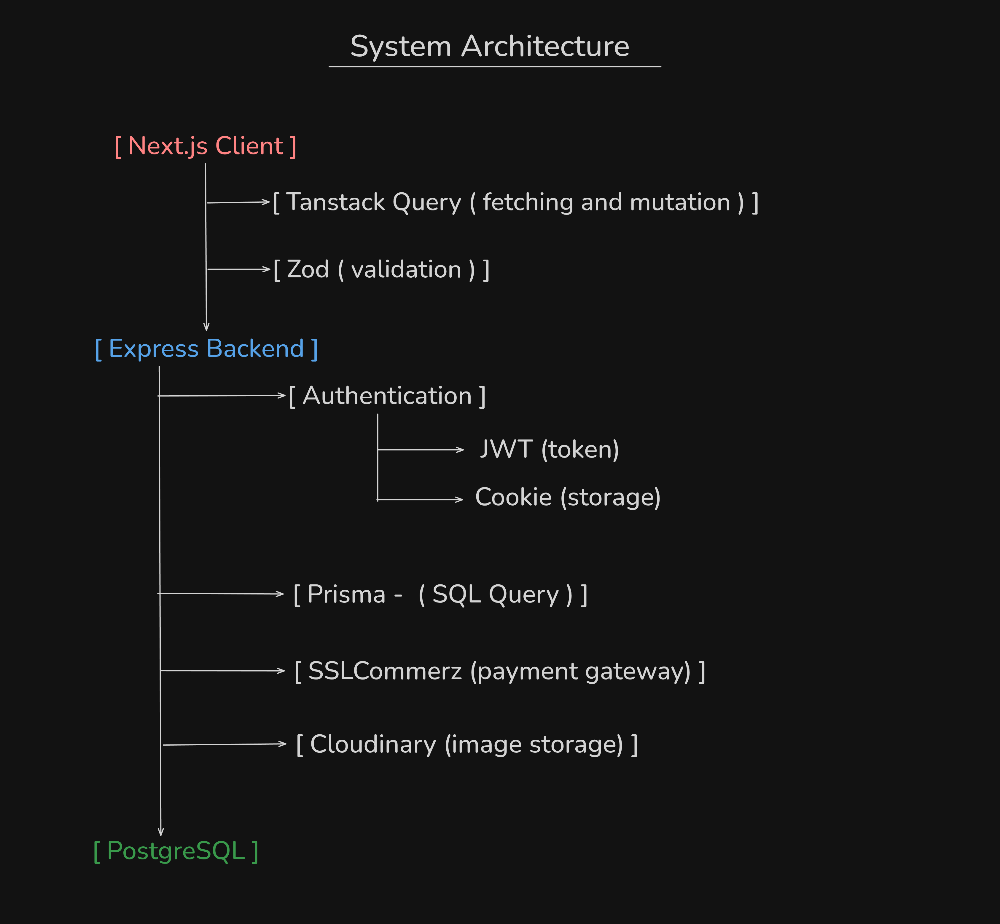
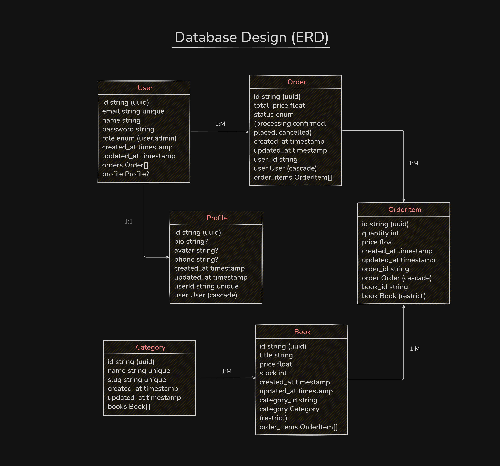
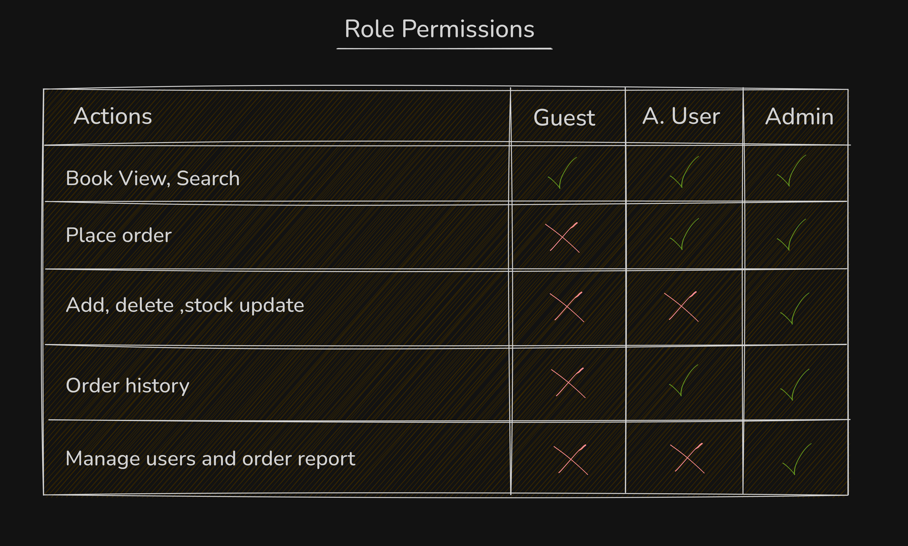
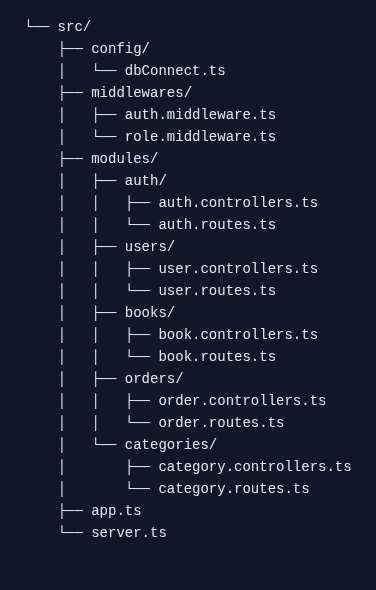

# 📚 Bookstore REST API Backend

A scalable, secure, and production-grade E-Commerce backend API built with **Node.js**, **Express.js**, **TypeScript**, **Prisma ORM**, and **PostgreSQL (Supabase)**.

---

## 🚀 Key Highlights

- **Custom Built-in Authentication (No Third-Party Auth Providers)**: Implemented completely from scratch using custom JWT verification, bcrypt password hashing, and cookie/header token handling—without relying on external auth services (like Firebase, Clerk, or Supabase Auth).
- **Role-Based Access Control (RBAC)**: Custom middleware guarding endpoints across `USER` and `ADMIN` roles.
- **Relational Data Modeling**: Designed with explicit `1:1`, `1:N`, and `M:N` relations via Prisma ORM.
- **Atomic Transactions & Inventory Safety**: Uses `prisma.$transaction` and safe stock decrements to prevent concurrency issues and overselling.
- **Snapshot Pricing Pattern**: Retains historical unit prices on orders even if catalog book prices change later.
- **Clean Modular Structure**: Feature-based architecture separating controllers, routes, and services.

---

## 🏛 System Architecture & Design Documents

All system diagrams and design specifications are maintained in the [`docs/`](docs) directory.

### 1. System Architecture
Layered request pipeline spanning HTTP routing, custom auth/RBAC guards, controllers, and Prisma persistence.

### 2. Database Entity Relationship Diagram (ERD)
Normalized relational schema modeling users, profiles, categories, books, and order snapshots.

### 3. Role-Based Access Control (RBAC) Actions
Visual map of permissions for guests, customers, and administrators.

### 4. Folder Structure
Clean domain-driven modular structure for high maintainability.

---

## 📡 API Overview

| Module | Method | Endpoint | Access | Description |
| :--- | :---: | :--- | :---: | :--- |
| **Auth** | `POST` | `/api/v1/auth/register` | Public | Register a new user |
| | `POST` | `/api/v1/auth/login` | Public | Authenticate & issue token |
| **Books** | `GET` | `/api/v1/books` | Public | Search, filter & paginate books |
| | `GET` | `/api/v1/books/:id` | Public | View book details |
| | `POST` | `/api/v1/books` | Admin | Create book entry |
| | `PATCH`| `/api/v1/books/:id` | Admin | Update book or stock |
| | `DELETE`| `/api/v1/books/:id`| Admin | Remove book |
| **Categories** | `GET` | `/api/v1/categories` | Public | List categories |
| | `POST`| `/api/v1/categories` | Admin | Create category |
| **Orders** | `POST` | `/api/v1/orders` | User | Place order (Atomic checkout) |
| | `GET` | `/api/v1/orders/my-orders`| User | View own orders |
| | `GET` | `/api/v1/orders` | Admin | View all customer orders |
| | `PATCH`| `/api/v1/orders/:id/status`| Admin | Update order status |

## 📄 License

This project is licensed under the ISC License.
